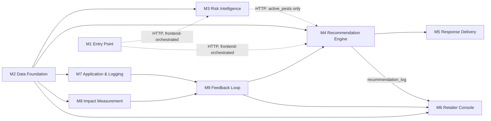

# KrishiSathi — Architecture Audit (Module 1–9)

Audited against the actual source tree at commit `141c902` (branch `ui/nocturne-redesign`). CLAUDE.md was read first as a map, then every claim below was checked against the real files in `app/`, `frontend/`, `data/`, and `tests/`. Where the code disagrees with CLAUDE.md, or with a stale comment inside the code itself, that's flagged explicitly rather than silently resolved.

**Scope note:** CLAUDE.md defines 10 modules (M1–M10). This report covers M1–M9 as requested; M10 (Platform & Infra, `app/main.py`) is folded into "Shared / Cross-Cutting Components" at the end, since it doesn't have its own service/route/schema files — it's the wiring that mounts everyone else's routers.

## Table of Contents

- [Module 1: Entry Point](#module-1-entry-point)
- [Module 2: Data Foundation](#module-2-data-foundation)
- [Module 3: Risk Intelligence](#module-3-risk-intelligence)
- [Module 4: Recommendation Engine](#module-4-recommendation-engine)
- [Module 5: Response Delivery](#module-5-response-delivery)
- [Module 6: Retailer Console](#module-6-retailer-console)
- [Module 7: Application & Logging](#module-7-application--logging)
- [Module 8: Impact Measurement](#module-8-impact-measurement)
- [Module 9: Feedback Loop](#module-9-feedback-loop)
- [Shared / Cross-Cutting Components](#shared--cross-cutting-components)
- [Module Dependency Map](#module-dependency-map)
- [System at a Glance](#system-at-a-glance)

---

### Module 1: Entry Point

- **Purpose** — Turns raw farmer input (typed text, and/or base64 voice audio, and/or a base64 photo) into the locked `FarmerRequest` shape everything downstream reads. Owns transcription and a single multimodal Gemini call that extracts `crop`, `symptom_description`, `language`. Out of scope: photo storage (no real Firebase Storage upload — see Gotchas), and it does not itself call M3/M4 — that orchestration is the frontend's job (see Inter-Module Communication).
- **Tech Stack** — FastAPI route, Pydantic v2 schemas, Google Cloud Speech-to-Text (`google-cloud-speech==2.40.0`), Gemini via the shared `llm_service` (see Cross-Cutting).
- **Entry Points** — `POST /entry-point` (`app/routes/entry_point.py:10`) → `entry_point_service.process_entry(payload: EntryPointInput) -> FarmerRequest` (`app/services/entry_point.py:144`).
- **Exit Points** — Returns a `FarmerRequest` (crop, location, symptom_description, language, photo_present, photo_url). Raises `422` via `NoUsableInputError` when there's no text, transcript, or photo at all. No DB writes; no downstream calls made from within this module.
- **Inter-Module Communication** — Reads nothing from other backend modules directly. Called first in the frontend's per-message pipeline (`frontend/index.html:1053`), which then feeds its JSON response as the request body to `/risk-context` and `/recommend`. Communication with M3/M4 is HTTP, synchronous, orchestrated client-side — not a server-side call chain.
- **Key Dependencies & Config** — `app/services/llm_service.py`, `app/services/speech_to_text.py`. Config: `GOOGLE_CLOUD_PROJECT` (gates Cloud STT), `GEMINI_API_KEY`/`GOOGLE_CLOUD_PROJECT` (gates Gemini — see Cross-Cutting for the two-tier logic).
- **File/Directory Map** — `app/routes/entry_point.py`, `app/services/entry_point.py`, `app/schemas/entry_point.py`.
- **Notable Design Decisions or Gotchas**
  - `location`, `photo_present`, `photo_url` are *never* taken from the LLM's output, even though the prompt echoes them back — `_validate_extraction()` always overwrites with the server-known values (`app/services/entry_point.py:114-141`). This is the same "don't trust what can be verified directly" pattern used in M4 and M7.
  - `photo_url` is a hardcoded placeholder string (`"gs://krishisathi-stub/pending-upload.jpg"`) when a photo is present — there is no real Firebase Storage upload wired up. This is explicitly labeled `# STUB` in the code (`app/services/entry_point.py:151-156`), consistent with CLAUDE.md's "deferred to phase 2" list.
  - **Discrepancy:** the module docstring at the top of `app/services/entry_point.py` (lines 1–20) still says the extraction call uses `gemini-2.0-flash-001`. That model is stated elsewhere (CLAUDE.md, and `llm_service.py`'s own docstring/`MODEL_NAME` constant) to be fully retired as of June 1, 2026, replaced by `gemini-3.5-flash`. The actual model used at runtime is correct (`gemini-3.5-flash`, since all Gemini calls route through the shared `llm_service.generate_response()`), but this file's comment is stale and would mislead a reader about what model is actually in use.
  - Deterministic fallback (`_fallback_extraction`) is a real code path exercised whenever Gemini is unavailable — it uses the raw/transcribed text directly as the symptom and trusts a client-supplied `crop` hint (the one place in the codebase a client's crop claim is used, since there's no LLM in this path to determine it independently).
- **Confidence & Gaps** — Confirmed by direct source read. Not independently verified: whether Cloud STT's language-code table (`pa-guru-IN` etc.) actually works against a live Punjabi audio sample — no live-credential test exists in this environment (by design, see `tests/conftest.py`).

---

### Module 2: Data Foundation

- **Purpose** — The read-only datasets nearly every other module reads from: pest history, product efficacy catalog, counterfeit batch registry, soil type by district. No HTTP route — it's a pure Python module. Out of scope: it does not compute anything (no scoring, no retrieval ranking) — that's M3/M4's job.
- **Tech Stack** — Plain Python + `json` stdlib. Backed by four flat JSON files under `data/` (`pest_history.json`, `efficacy_dataset.json`, `batch_registry.json`, `soil_type_by_district.json`), loaded once at import time into module-level dicts/lists.
- **Entry Points** — Exported functions only, imported directly by other services: `get_pest_history(district, crop="wheat")`, `get_pest_history_detail(district, crop="wheat")`, `get_efficacy_dataset()`, `check_batch(batch_number)`, `get_soil_type(district)`, `get_product_catalog()` (`app/services/data_foundation.py`).
- **Exit Points** — Returns lists/dicts read from the in-memory copies of the JSON files. No writes — this module is read-only by design.
- **Inter-Module Communication** — Direct Python import, in-process, synchronous. Consumed by: M3 (`get_soil_type`, `get_pest_history_detail`), M4 (`get_efficacy_dataset` via `retrieval.py`, `get_soil_type`, `get_pest_history`), M6 (`get_product_catalog` — see Gotchas), M7 (`check_batch`), M8 (`get_soil_type`, indirectly via `impact_data.py`).
- **Key Dependencies & Config** — None external; no env vars. `DATA_DIR` is resolved relative to the file's own location (`app/services/data_foundation.py:22`), not a config value.
- **File/Directory Map** — `app/services/data_foundation.py` (logic), `data/pest_history.json`, `data/efficacy_dataset.json`, `data/batch_registry.json`, `data/soil_type_by_district.json` (data).
- **Notable Design Decisions or Gotchas**
  - `get_product_catalog()` is an explicitly-documented backward-compat adapter reshaping `get_efficacy_dataset()` rows into an older `{"name", "mode_of_action", "targets"}` shape. `module_imple.md` (an in-repo planning doc, not CLAUDE.md) confirms this is deliberately kept alive for `retailer.py` to keep using rather than migrated — worth knowing before "cleaning it up."
  - Every JSON file is labeled in CLAUDE.md as carrying a `data_basis` field documenting how placeholder it is (hard constraint #3: label simulated data as simulated) — this audit did not open the JSON files themselves to confirm every record actually carries that field; flagged as unverified.
  - **Discrepancy vs. CLAUDE.md's tech table:** CLAUDE.md lists Qdrant as the vector DB and BigQuery as the data warehouse for pest history/efficacy tables. In the actual code, M2 itself has no Qdrant or BigQuery dependency at all — it's flat JSON files. Qdrant only enters the picture inside M4's `retrieval.py`, which builds its own in-memory/embedded Qdrant index from `get_efficacy_dataset()`'s output at request time. BigQuery is not wired up anywhere in the codebase; the module docstring itself flags this with `# STUB: swap the JSON-file loads below for BigQuery ... and Qdrant ... once those are wired up` (`app/services/data_foundation.py:11-16`). This matches CLAUDE.md's own "what's simulated" framing (M2's storage format is meant to change without callers noticing), so it's a documented gap, not a silent one.
- **Confidence & Gaps** — Confirmed by direct source read of `data_foundation.py`. JSON file contents (schema-per-record, `data_basis` labeling) not opened/verified in this pass.

---

### Module 3: Risk Intelligence

- **Purpose** — Decides whether now is a reasonable time to act, before M4 recommends anything: combines a live weather check, M2's pest-history lookup, and M2's soil-type lookup into a `readiness_score` and `should_proceed` boolean, per the CLAUDE.md-locked `RiskContext` contract. Out of scope, explicitly: this is a rules-based scoring function, not a trained model, per CLAUDE.md and the module's own docstring.
- **Tech Stack** — FastAPI route, Pydantic v2 schemas, a small pure-Python scoring function, Open-Meteo (free, no-API-key weather HTTP API, called via `urllib` — not a client library), Gemini via `llm_service` for the `early_warning` sentence.
- **Entry Points** — `POST /risk-context` (`app/routes/risk_context.py:11`) → `risk_context_service.assess_risk(farmer_request: FarmerRequest) -> RiskContext` (`app/services/risk_context.py:112`). Also exposes pure/testable helpers: `compute_readiness(rain_penalty_applied, soil_known, pest_active) -> (score, should_proceed)` and `pests_active_within_window(...)`.
- **Exit Points** — Returns a `RiskContext` (readiness_score, should_proceed, weather_summary, active_pests, early_warning). No DB writes.
- **Inter-Module Communication** — Reads M2 directly (`data_foundation.get_soil_type`, `get_pest_history_detail`) and calls `weather_service.get_forecast()` (external HTTPS to Open-Meteo). Called by the frontend after `/entry-point` and before `/recommend` (`frontend/index.html:1068`); its output (`risk_context`) is then passed straight into the `/recommend` request body (`frontend/index.html:1082`) — but see Gotchas re: whether M4 actually *uses* it.
- **Key Dependencies & Config** — No env var gates weather (Open-Meteo needs no key). Gemini's `early_warning` text generation gates on `GEMINI_API_KEY`/`GOOGLE_CLOUD_PROJECT` same as every other Gemini call.
- **File/Directory Map** — `app/routes/risk_context.py`, `app/services/risk_context.py`, `app/services/weather_service.py`, `app/schemas/risk_context.py`.
- **Notable Design Decisions or Gotchas**
  - Score rule (`compute_readiness`, `app/services/risk_context.py:71-81`): start at 0, `-2` if forecast rain over 5 days exceeds `RAIN_THRESHOLD_MM = 15.0mm`, `+1` if soil data is known for the district, `+2` if a regionally-active pest for this crop is within a ±1-month window of the current month. `should_proceed = score >= 0`. This matches CLAUDE.md's example rule shape closely (CLAUDE.md's illustrative version uses "soil_moisture_reasonable"; the real implementation uses "soil data is known" — a defensible reading given M2 has no live moisture sensor).
  - Unknown-district handling: if `get_soil_type()` returns `None`, the function short-circuits to a labeled-neutral `RiskContext` (`readiness_score=0`, `should_proceed=True`, `weather_summary` explicitly says "no data available... showing a neutral default rather than a guess") without calling the weather API at all. Matches CLAUDE.md's honesty constraint.
  - **Verify before relying on it:** whether M3's output is actually consumed by M4's *scoring* is worth checking directly — see Module 4's Gotchas. M3's `active_pests` is read by `recommend.py` when `risk_context` is passed (`app/services/recommend.py:193-197`), but `should_proceed`/`readiness_score` are not read by `recommend.py` at all; M4 will still generate a recommendation even when M3 says not to proceed. This isn't a bug per se — the frontend still shows the `early_warning` banner from M3's stage independently — but the CLAUDE.md dependency graph's implied "M3 gates M4" reads more strongly than what the code does (M3 informs M4's pest list, not whether M4 runs).
- **Confidence & Gaps** — Confirmed by direct source read, both `risk_context.py` and `weather_service.py`.

---

### Module 4: Recommendation Engine

- **Purpose** — The first "depth piece": retrieves relevant candidate products from M2's efficacy dataset, then uses Gemini (constrained to only ever choose from the retrieved candidates) to produce a plain-language recommendation with a confidence score. Hard constraint #1 from CLAUDE.md — never invent a product — is enforced twice: once via a similarity gate at retrieval time, and again in code via `_validate_llm_choice`, which discards anything the model proposes that isn't a literal candidate `product_name`. Out of scope: it does not decide *whether* to act (that's M3) and does not persist outcomes (that's M7).
- **Tech Stack** — FastAPI route, Pydantic v2, Qdrant (`qdrant_client`, run in `:memory:` mode unless `QDRANT_URL` is set) for nearest-neighbour candidate search, scikit-learn `TfidfVectorizer` for embeddings (not a hosted embedding model — a deliberate, documented choice, not a stub), Gemini via `llm_service`, SQLite (`recommendation_log.py`) for a small append-only recommendation history.
- **Entry Points** — `POST /recommend` (`app/routes/recommend.py:10`) → `recommend_service.generate_recommendation(req: RecommendationRequest) -> Recommendation` (`app/services/recommend.py:189`). Internally: `retrieval.retrieve_candidates(crop, symptom_description, active_pests, soil_type, top_k=5)` (`app/services/retrieval.py:136`).
- **Exit Points** — Returns a `Recommendation` (recommended_product, confidence_score, plain_language_reason, mode_of_action, neighbour_proof, no_confident_match) — the exact CLAUDE.md contract. Side effect: on a confident (non-`no_confident_match`) result, writes one row to `data/recommendation_log.sqlite3` via `recommendation_log.log_recommendation()` (`app/services/recommend.py:238`).
- **Inter-Module Communication** — Reads M2 directly (`data_foundation.get_pest_history`, `get_soil_type`). Reads M9's `feedback_loop.get_confidence_boost()` to nudge the confidence score up (in-process call, `app/services/recommend.py:232`). Reads M7's persisted outcomes indirectly via `outcome_store.get_outcomes()` inside `_real_neighbour_proof()` to populate `neighbour_proof` honestly. Writes to its own recommendation log, which M6 later aggregates. Called by the frontend after `/risk-context`.
- **Key Dependencies & Config** — `QDRANT_URL` (empty → in-memory Qdrant), Gemini env vars. `app/services/retrieval.py`, `app/services/feedback_loop.py`, `app/services/outcome_store.py`, `app/services/recommendation_log.py`, `app/services/impact_data.py` (for the baseline yield constant used in neighbour-proof phrasing).
- **File/Directory Map** — `app/routes/recommend.py`, `app/services/recommend.py`, `app/services/retrieval.py`, `app/services/recommendation_log.py`, `app/schemas/recommend.py`.
- **Notable Design Decisions or Gotchas**
  - Retrieval's relevance gate (`MIN_SIMILARITY = 0.12`) runs *before* Gemini ever sees candidates — an empty candidate list short-circuits straight to an honest `no_confident_match` without an LLM call at all (`app/services/recommend.py:207-210`).
  - `retrieval.py`'s docstring documents a real bug-and-fix worth knowing about: `active_pests` used to be concatenated directly into the TF-IDF query text, which meant a district's active pests alone (which don't vary per request) could produce a confident-looking match for *any* symptom text, including gibberish — because the district's pest names, not the actual symptom, were driving the score. This was fixed by using `soil_type`/`active_pests` only as post-gate ranking bonuses (`SOIL_MATCH_BONUS`, `PEST_MATCH_BONUS`), never part of the primary similarity query. Confirmed in code (`app/services/retrieval.py:89-130`) — this is exactly the kind of thing the "never invent a product" constraint depends on, and it's good that it's both documented and structurally enforced now.
  - `neighbour_proof.available` is `False` with a hardcoded reason string until M9/M7 data exists for that product+district — the code has since been updated (per `_real_neighbour_proof`) to genuinely reflect real logged outcomes, but the module's own top-of-file docstring (lines 1–17) still says "neighbour_proof.available is always False here" — **stale docstring**, contradicted by the actual `_real_neighbour_proof()` function three lines below it and by the M9 wiring (`app/services/recommend.py:107-128, 230-238`). Worth fixing so a future reader doesn't get misled by the module-level comment over the function it's describing.
- **Confidence & Gaps** — Confirmed by direct source read of `recommend.py`, `retrieval.py`, `recommendation_log.py`, and by reading `tests/test_recommend_adversarial.py`. That test file has 10 parametrized adversarial cases (crop mismatch, gibberish, empty input, non-English text, prompt injection, SQL/script injection text, off-topic questions, unknown district) plus 11 further non-parametrized tests targeting the validator boundary directly — roughly 21 individual test cases in total, consistent with (if not exactly matching) `module_imple.md`'s repeated reference to "the 20 adversarial tests."

---

### Module 5: Response Delivery

- **Purpose** — Turns a `Recommendation` into what actually reaches the farmer: an English message translated into their language, synthesized audio, and an expectation-setting message (the "you won't see results for ~3 weeks" trust feature). Out of scope: it doesn't decide *what* to recommend (M4's job) and it authors all source copy in English before translating — it never asks Gemini to compose the message.
- **Tech Stack** — FastAPI route, Pydantic v2, Google Cloud Translation API (`google-cloud-translate==3.27.0`), Google Cloud Text-to-Speech with Chirp 3 HD voices (`google-cloud-texttospeech==2.37.0`).
- **Entry Points** — `POST /deliver` (`app/routes/delivery.py:10`) → `delivery_service.deliver(req: DeliveryRequest) -> DeliveryResponse` (`app/services/delivery.py:59`).
- **Exit Points** — Returns a `DeliveryResponse` (chat_message, translated_language, audio_url, expectation_setting, trust_features_shown). `audio_url` is a `data:audio/mp3;base64,...` URI (inline, playable directly by a browser `<audio>` tag) — not a Firebase Storage link, since no upload path is wired up (same pattern as M1's photo). No DB writes.
- **Inter-Module Communication** — Takes a `Recommendation` (M4's exact output shape) as input — direct schema reuse, not a new type. Called by the frontend immediately after `/recommend` (`frontend/index.html:1090`), same synchronous per-message pipeline as M1/M3/M4.
- **Key Dependencies & Config** — `GOOGLE_CLOUD_PROJECT` gates both Cloud Translation and Cloud TTS (both fall back honestly — untranslated English text, and `audio_url: null`, respectively — rather than fabricating output).
- **File/Directory Map** — `app/routes/delivery.py`, `app/services/delivery.py`, `app/services/translation_service.py`, `app/services/tts_service.py`, `app/schemas/delivery.py`.
- **Notable Design Decisions or Gotchas**
  - `translated_language` is deliberately conservative: if the chat message and expectation-setting message somehow end up translated to different actual languages (one succeeded, one silently fell back), the response reports `"en"` rather than claiming a language that isn't uniformly true (`app/services/delivery.py:65-70`).
  - TTS has its own internal fallback layer independent of the module-level `TextToSpeechNotConfiguredError`: if the Chirp 3 HD voice call itself errors (CLAUDE.md flags Punjabi's HD voice as Preview), it retries with a standard voice for the same locale before giving up (`app/services/tts_service.py:61-76`).
  - `DeliveryRequest`/`DeliveryResponse` are **not** part of CLAUDE.md's locked data contract (only M1/M3/M4/M7/M8 shapes are documented there) — the schema doc comment says this explicitly (`app/schemas/delivery.py:1-6`), so this isn't an unreported deviation, just worth knowing it's team-designed rather than spec-locked.
- **Confidence & Gaps** — Confirmed by direct source read.

---

### Module 6: Retailer Console

- **Purpose** — A read-only district-level view for a retailer: what's being recommended nearby, with real outcome evidence, plus a simple frequency-based stock signal. Explicitly not a forecasting model (per CLAUDE.md and the code's own comments). Out of scope: it does not write recommendation history itself — it reads M4's log.
- **Tech Stack** — FastAPI route (GET, not POST — the only read-style endpoint in the app), Pydantic v2, plain Python aggregation (`collections.defaultdict`) over SQLite-backed data.
- **Entry Points** — `GET /retailer?district=...` (`app/routes/retailer.py:11`, defaults to `district="Ludhiana"`) → `retailer_service.get_district_console(district: str) -> RetailerConsoleResponse` (`app/services/retailer.py:86`).
- **Exit Points** — Returns `RetailerConsoleResponse` (district, recent_recommendations[], stock_signal[], generated_at). No writes — pure aggregation/read.
- **Inter-Module Communication** — Reads M4's `recommendation_log.get_recent_recommendations(district)` directly (in-process import). Reads M9's `feedback_loop.get_retailer_evidence(district)` directly for outcome evidence. Called by the frontend's retailer tab (`frontend/index.html:876`) independently of the farmer chat pipeline — it's a separate UI view, not chained off the M1–M5 flow.
- **Key Dependencies & Config** — None beyond the shared SQLite file M4 already writes (`data/recommendation_log.sqlite3`). No env vars specific to this module.
- **File/Directory Map** — `app/routes/retailer.py`, `app/services/retailer.py`, `app/schemas/retailer.py`.
- **Notable Design Decisions or Gotchas**
  - `demand_level` (`high`/`medium`/`low`) is relative to the district's own busiest product (ratio to `max_count`, thresholds `HIGH_DEMAND_RATIO = 0.7`, `MEDIUM_DEMAND_RATIO = 0.4`), not an absolute count threshold — documented as a deliberate call so a district with 3 total recommendations and one with 300 both produce meaningful signal (`app/services/retailer.py:21-26`).
  - An empty/no-activity district returns a well-formed response with empty lists rather than a 404 or an error — matches CLAUDE.md's "honest empty response, not fabricated data" pattern (confirmed structurally: `_aggregate_recommendations` and `_compute_stock_signal` both return `[]` cleanly when `get_recent_recommendations` returns nothing).
  - **Not part of CLAUDE.md's locked data contract** — `RetailerConsoleResponse`'s shape was designed during the M6 build (per `module_imple.md`) and the schema file says as much (`app/schemas/retailer.py:1-9`). This is fine — CLAUDE.md itself only locks M1/M3/M4/M7/M8 shapes — but worth knowing this contract could still evolve without violating the "agree contract changes with the team" rule, since it was never one of the locked shapes to begin with.
- **Confidence & Gaps** — Confirmed by direct source read. Frontend retailer-tab markup was located (`frontend/index.html:876` onward) but not rendered/exercised in a browser in this audit.

---

### Module 7: Application & Logging

- **Purpose** — Logs what actually happened after a farmer applies a product: verifies the claimed batch number server-side against M2's counterfeit registry (never trusting a client-asserted `batch_verified` flag), and persists the outcome durably. Out of scope: does not compute causal impact itself (M8) and does not decide whether the *outcome is good* (M9 does that classification).
- **Tech Stack** — FastAPI route, Pydantic v2, Google Cloud Firestore (`google-cloud-firestore==2.28.1`) as the primary store, with a real local SQLite queue as an offline fallback — not a stub, a genuine offline-first write path.
- **Entry Points** — `POST /log-outcome` (`app/routes/outcome_log.py:11`) → `outcome_log_service.log_outcome(payload: OutcomeLogInput) -> OutcomeLog` (`app/services/outcome_log.py:25`).
- **Exit Points** — Returns `OutcomeLog` (farmer_id, product_used, batch_verified, application_date, observed_outcome, yield_result, synced) — the exact CLAUDE.md contract. Side effect: writes one row to Firestore (if configured/reachable) and/or `data/outcome_log_cache.sqlite3` via `outcome_store.save_outcome()`.
- **Inter-Module Communication** — Reads M2's `data_foundation.check_batch(batch_number)` directly. Its persisted records are read by M9 (`outcome_store.get_outcomes()`, `get_outcomes_by_district()`), which in turn feeds M4 and M6. Called by the frontend's "log outcome" form after a recommendation has been delivered (`frontend/index.html:1115-1148`), then chains directly into `measureImpact()` client-side (`frontend/index.html:1144`).
- **Key Dependencies & Config** — `GOOGLE_CLOUD_PROJECT` gates the real Firestore write path; absent, every write lands in local SQLite with `synced=False` and is retryable via `outcome_store.sync_pending()`.
- **File/Directory Map** — `app/routes/outcome_log.py`, `app/services/outcome_log.py`, `app/services/outcome_store.py`, `app/schemas/outcome_log.py`.
- **Notable Design Decisions or Gotchas**
  - `batch_verified` is computed server-side from `check_batch()`, never accepted as a client-supplied boolean — the schema itself was redesigned around this (`app/schemas/outcome_log.py:1-12` documents that `OutcomeLogInput` takes `batch_number`, not a `batch_verified` claim). An unverified/counterfeit batch's outcome is still logged (not rejected) — a farmer's real-world result is worth keeping either way — but flows through with `batch_verified=False` so nothing downstream (M8, M9) mistakes it for a genuine-product outcome.
  - `outcome_store.py`'s docstring gives a specific, well-reasoned explanation for why this backend uses its own SQLite queue rather than Firestore's client-side `persistentLocalCache`: that feature belongs to Firestore's *client* SDKs (mobile/web devices), while this backend uses the Admin SDK, which has no offline mode of its own — so the SQLite queue is the architecturally-equivalent thing for *this process* to do (`app/services/outcome_store.py:1-26`). Worth knowing this is a deliberate architectural substitution, not a shortcut around CLAUDE.md's stated Firestore choice.
  - `district` travels on `OutcomeLogInput` and is persisted internally, but is **not** part of the locked `OutcomeLog` response contract — it's silently dropped from the response (Pydantic ignores unmodeled keys) while still being kept in the raw record M9 reads (`app/services/outcome_log.py:42-51`).
- **Confidence & Gaps** — Confirmed by direct source read, including the `RemoteStore` Protocol pattern that lets tests inject a fake Firestore client without real GCP credentials (`app/services/outcome_store.py:43-56`).

---

### Module 8: Impact Measurement

- **Purpose** — The second "depth piece": estimates a product's causal effect on wheat yield using a difference-in-differences (DiD) regression, converts it to ₹/acre ROI, and reports a confidence *range*, never a single overclaimed number (CLAUDE.md hard constraint #2). Out of scope: per-farmer causal attribution — the code is explicit that this isn't possible yet (see Gotchas).
- **Tech Stack** — FastAPI route, Pydantic v2, `pandas` + `statsmodels` (OLS via `smf.ols`, per CLAUDE.md's explicit "not DoWhy/EconML" instruction), Gemini via `llm_service` for narration only (never for computing the numbers).
- **Entry Points** — `POST /measure-impact` (`app/routes/impact.py:11`) → `impact_service.measure_impact(req: ImpactRequest) -> ImpactEstimate` (`app/services/impact.py:140`). Also exposes `impact_data.generate_synthetic_season_panel()` and `impact_data.fit_did_model(panel)` as independently-testable pure functions.
- **Exit Points** — Returns `ImpactEstimate` (estimated_effect_pct, confidence_range, roi_per_acre_inr, nitrogen_saved_kg, data_basis) — CLAUDE.md's exact locked contract, with `data_basis` always forced to `"simulated"` regardless of what Gemini's narration pass returns (`app/services/impact.py:136`). Side effect: appends the computed estimate to an in-memory, process-lifetime `deque` keyed by `(product_used, district)` (`_recent_estimates`, `app/services/impact.py:36-51`), read back by M9.
- **Inter-Module Communication** — Reads M2's `get_soil_type()` indirectly via `impact_data.py`'s synthetic panel generator (soil texture affects the simulated yield). Its `get_recent_estimates()` is read directly by M9's `feedback_loop.py` for a corroboration signal. Called by the frontend right after a successful `/log-outcome` (`frontend/index.html:1144`).
- **Key Dependencies & Config** — No external API dependency for the model itself (pure local computation); Gemini gates only the narration/formatting pass, with a full computed-values fallback if it's unavailable or returns something that doesn't check out numerically.
- **File/Directory Map** — `app/routes/impact.py`, `app/services/impact.py`, `app/services/impact_data.py`, `app/schemas/impact.py`.
- **Notable Design Decisions or Gotchas**
  - **The model does not currently consume M7's real logged outcomes.** The module's own docstring says so directly: "M7 now persists real outcome logs, but there's no way yet to attribute a specific farmer's yield to this product versus what would've happened anyway (that needs matched control data this demo doesn't have)... this returns the DiD model's current population-level estimate... fit on the synthetic panel" (`app/services/impact.py:1-16`). This means the CLAUDE.md dependency graph's `M7 → M8` arrow doesn't hold in the current implementation — M8's causal estimate is computed entirely from `impact_data.py`'s synthetic panel (fixed random seed 42, N=300 simulated farmers), independent of anything M7 has logged. What *does* flow from M7 is a separate path into M9 (`outcome_store.get_outcomes()`), not into M8. This is honestly documented in the code, not hidden — but it's a real gap between the stated architecture and what runs.
  - `TRUE_EFFECT_PCT = 12.0` is a hardcoded, documented ground-truth constant baked into the synthetic generator specifically so `tests/test_impact.py` can verify the DiD model actually *recovers* something close to the true effect from the noisy simulated panel — this is the test that proves the model code (not just the data) is real, per CLAUDE.md's causal-model requirement.
  - Gemini's narration pass is bounded by numeric tolerance checks (`_validate_narration`, `app/services/impact.py:104-137`) — any field the LLM returns that doesn't match the actually-computed value within tolerance is silently replaced with the real computed value. This mirrors M4's `_validate_llm_choice` safety-boundary pattern.
  - Persisted estimates (`_recent_estimates`) are in-memory only, reset on process restart — documented as an acceptable tradeoff for a single-process demo, consistent with M4's retrieval index and its own DiD-result cache using the same pattern.
- **Confidence & Gaps** — Confirmed by direct source read of `impact.py` and `impact_data.py`. `nitrogen_saved_kg`'s "1.5 kg N saved per 1% effect" ratio is explicitly labeled in-code as an illustrative, non-measured assumption (`app/services/impact_data.py` — actually this specific comment lives in `impact.py:74-78`) — flagged in the code itself, not something this audit had to independently discover.

---

### Module 9: Feedback Loop

- **Purpose** — Closes the loop CLAUDE.md describes: turns real logged outcomes (M7) and real impact estimates (M8) into a small, capped, additive boost to M4's confidence score, plus a district-level evidence summary for M6. Explicitly "a simple running average... arithmetic is enough" (CLAUDE.md, quoted directly in the module docstring) — not a retraining pipeline. Out of scope: it does not itself decide what to recommend or aggregate recommendation history (that's M4's log for M6 to read).
- **Tech Stack** — Pure Python, no FastAPI route (confirmed: it's absent from `app/main.py`'s router list and the README's endpoint table both explicitly note "M2 and M9 have no route").
- **Entry Points** — Exported functions, called in-process: `get_confidence_boost(product_name: str, district: Optional[str] = None) -> float` (`app/services/feedback_loop.py:44`), `get_retailer_evidence(district: str) -> Dict` (`app/services/feedback_loop.py:63`).
- **Exit Points** — Returns a float (0.0–0.10, capped) or a dict summary. No writes of its own — pure read/compute over data M7 and M8 already persisted.
- **Inter-Module Communication** — Reads M7's `outcome_store.get_outcomes()` / `get_outcomes_by_district()` directly. Reads M8's `impact.get_recent_estimates()` directly. Its output is consumed by M4 (`recommend.py:232`, additive to `confidence_score`) and M6 (`retailer.py:35`, for `avg_outcome_summary`/`outcomes_logged`). All in-process Python imports — no HTTP hop, no queue.
- **Key Dependencies & Config** — None of its own; entirely dependent on what M7/M8 have already persisted. `POSITIVE_OUTCOME_YIELD_THRESHOLD` reuses M8's `impact_data.BASE_YIELD_QUINTALS_PER_ACRE` (21.0 quintals/acre) rather than defining a second baseline — a documented, deliberate reuse (`app/services/feedback_loop.py:21-26`).
- **File/Directory Map** — `app/services/feedback_loop.py` only — no route, no schema file of its own (its outputs are plain `float`/`dict`, not Pydantic models, since nothing exposes them over HTTP).
- **Notable Design Decisions or Gotchas**
  - The boost is two-part and both parts are capped: `outcome_boost` = `0.02` per positive logged outcome, capped at `MAX_OUTCOME_BOOST = 0.08`; plus a flat `IMPACT_CORROBORATION_BOOST = 0.02` if M8's own recent estimate for that product/district is also positive; the *total* is separately capped at `MAX_TOTAL_BOOST = 0.10` (`app/services/feedback_loop.py:28-34, 44-60`). With zero data, the boost is exactly `0.0` — verified structurally (both terms default to `0.0` when their source lists are empty).
  - `get_retailer_evidence()` deliberately does **not** include recommendation-history aggregation (counts/avg confidence) — the docstring is explicit that this is M6's own job, not M9's, to avoid overlapping responsibility (`app/services/feedback_loop.py:63-73`).
  - The module docstring notes a real correction made during development: `get_outcomes()` was assumed to already exist on `outcome_store.py` from earlier notes, but was verified by directly reading that file rather than trusted — and had to be added. Worth knowing this codebase's own comments show a pattern of "verify by reading the file, not by assuming a prior note was accurate," which is the same standard this audit was asked to hold CLAUDE.md to.
- **Confidence & Gaps** — Confirmed by direct source read, including `app/services/recommend.py:230-238` and `app/services/retailer.py:35-36` to verify the two consumption points are real, not just described.

---

### Shared / Cross-Cutting Components

**LLM Service (`app/services/llm_service.py`)**
- **Purpose** — The single choke point for all Gemini calls; CLAUDE.md's rule "All calls go through `app/services/llm_service.py`. Never call SDK directly from routes" is followed in practice — confirmed no other file in `app/` imports `google.genai` directly (M1, M3, M4, M8 all import `llm_service`, not the SDK).
- **Tech Stack** — Unified `google-genai==2.17.0` SDK, two auth tiers: Gemini Developer API (`GEMINI_API_KEY`, primary — tried first) and Vertex AI (`GOOGLE_CLOUD_PROJECT` + ADC, fallback). Model: `gemini-3.5-flash` (`MODEL_NAME`, `app/services/llm_service.py:41`).
- **How modules consume it** — `generate_response(prompt, system_prompt="", json_mode=False, image_bytes=None, image_mime_type=None) -> str`, plus `extract_json_object(text)` to robustly pull a JSON object out of Gemini's response even when it appends trailing garbage after a valid object (a live-observed behavior with `gemini-3.5-flash`'s JSON mode, documented in-code, not theoretical). Raises `LLMUnavailableError` (base) / `LLMNotConfiguredError` / `LLMCallFailedError`, which every caller catches to fall back to deterministic logic — never lets an LLM failure surface as a raw 500. `tests/test_llm_service.py` and `tests/conftest.py` confirm the automated suite always forces both tiers empty so tests never hit the real API and never burn the free tier's 20-requests/day cap.
- **Discrepancy vs. CLAUDE.md:** CLAUDE.md's tech table already documents the `gemini-2.0-flash-001` → `gemini-3.5-flash` migration and the reasoning behind it (2.0 retired June 1 2026, 2.5 has an Oct 16 2026 shutdown already scheduled) — the code matches CLAUDE.md correctly here. The only place still out of sync is the stale `gemini-2.0-flash-001` mention inside `entry_point.py`'s own docstring, noted under Module 1.

**Speech-to-Text / Translation / Text-to-Speech (`app/services/speech_to_text.py`, `translation_service.py`, `tts_service.py`)**
- **Purpose** — Thin, single-purpose wrappers around Google Cloud STT/Translation/TTS, each gated on `GOOGLE_CLOUD_PROJECT` and each with a real (not stubbed) fallback: text-only mode, untranslated English, and `audio_url=None` respectively.
- **Notable pattern** — All three follow an identical shape: a module-specific `*NotConfiguredError`, a config check before importing the (lazily-imported) GCP client library, and a documented reason the fallback is "real, working code," not a stub. This consistency across M1/M5's external-API wrappers is a deliberate, repeated house pattern, not incidental.

**Config (`app/core/config.py`)**
- **Purpose** — Single `pydantic-settings` `Settings` object; CLAUDE.md's rule "Nothing else in the app should call `os.environ`/`os.getenv` directly" holds — confirmed no other file in `app/` does so.
- **Discrepancy:** the file's own in-code comment block (`app/core/config.py:25-28`) still says: *"STUB: Firestore is the decided datastore... no SQL engine is configured in this skeleton pass because nothing yet persists data; all routes currently return in-memory fake/randomized values."* This is stale — it describes the very earliest skeleton commit (`dc50b93`, "Add running skeleton for all modules... wired end-to-end"), not the current state. Every module now genuinely persists (Firestore/SQLite for M7, SQLite for M4/M6's recommendation log) or computes real values. Worth cleaning up so a new engineer doesn't believe the app is still stub-only from reading this file.

**Dependencies (`app/core/dependencies.py`)**
- **Purpose** — Per CLAUDE.md's layer rules, this is meant to hold shared `Depends()` functions (e.g., a DB session, an auth check). Currently empty except for a comment.
- **Gotcha** — In practice, persistence clients (Firestore, SQLite connections) are instantiated directly inside `outcome_store.py`, `recommendation_log.py`, etc., rather than injected via FastAPI `Depends()`. This is a deviation from the user's global Development Constitution's stated layer rule (`core/` should hold "shared deps" that other layers consume via `Depends()`), but it's a reasonable one at this codebase's current scale — each persistence module already supports dependency injection for testing via its own `Optional[RemoteStore]` parameter pattern (see M7's `outcome_store.py`) rather than FastAPI's DI system. Worth knowing this is a conscious simplification, not an oversight, if the project later needs FastAPI-level DI (e.g., for auth).

**Global Development Constitution deviations (from `~/.claude/CLAUDE.md`)** — the user's global constitution mandates SQLAlchemy 2.0 + a `models/` directory + one config line to switch SQLite/Postgres. The project's own CLAUDE.md and README explicitly override this: the decided datastore is Firestore (with a real local SQLite fallback), not SQL/SQLAlchemy — confirmed there is no `app/models/` directory and no `database.py` anywhere in the tree. This is a documented, deliberate project-level override of the global default, not an unflagged inconsistency — the README says so directly ("the project's decided datastore is Firestore... not SQL/SQLAlchemy, so there's no `models/` or a general `database.py`").

**Frontend (`frontend/index.html`)**
- **Purpose** — The entire UI: landing/role-select page, farmer chat view with a 6-stage visual tracker (Ask/M1 → Risk Check/M3 → Recommend/M4 → Explain/M5 → Log Outcome/M7 → Prove Impact/M8), and a retailer console tab. One file, ~1,205 lines, no build step.
- **Tech Stack** — Vue 3 (CDN) + Bootstrap 5 (CDN), matching the user's global constitution exactly.
- **How it orchestrates the backend** — This is the actual pipeline conductor for M1→M3→M4→M5: `submitMessage()` awaits `/entry-point`, then `/risk-context` (passing M1's output), then `/recommend` (passing both M1's and M3's output), then `/deliver` (passing M4's output) — sequential, synchronous `fetch()` calls, each stage updating the visible tracker (`frontend/index.html:1053-1112`). `submitLogOutcome()` posts to `/log-outcome` then immediately chains into `measureImpact()` → `/measure-impact` (`frontend/index.html:1115-1157`). The retailer tab independently calls `GET /retailer?district=...` (`frontend/index.html:876`).
- **Confidence & Gaps** — Confirmed the fetch call sequence and stage-tracker wiring by direct source read; did not launch the app in a browser to visually verify rendering in this audit pass.

**Tests (`tests/`)**
- 14 test files, ~1,984 lines, one per module plus `test_routes.py` (integration-style, hits every route through FastAPI's TestClient) and `test_recommend_adversarial.py` (M4's hard-constraint suite). `tests/conftest.py` globally forces both Gemini auth tiers empty for every test run via an autouse fixture, specifically to keep the automated suite from ever touching the real API or the 20-requests/day free-tier cap — confirmed this is a deliberate, documented decision, not an oversight that happens to make tests deterministic.

---

### Module Dependency Map

Direct, in-process Python imports (verified from source), separate from the HTTP-level pipeline the frontend drives:

| Module | Imports directly from | Consumed by (in-process) |
|---|---|---|
| M1 Entry Point | `llm_service`, `speech_to_text` | — (frontend calls it first) |
| M2 Data Foundation | — | M3, M4 (`retrieval.py`), M6 (compat adapter), M7, M8 (`impact_data.py`) |
| M3 Risk Intelligence | M2, `weather_service`, `llm_service` | — (frontend passes its output into M4's request, but M4 doesn't read `should_proceed`/`readiness_score`) |
| M4 Recommendation Engine | M2, `retrieval`, `llm_service`, M9 (`feedback_loop`), M7 (`outcome_store`), `recommendation_log`, M8 (`impact_data`, constant only) | M6 (via `recommendation_log`) |
| M5 Response Delivery | `translation_service`, `tts_service` | — (terminal stage of the chat pipeline) |
| M6 Retailer Console | M4 (`recommendation_log`), M9 (`feedback_loop`) | — (terminal, its own UI tab) |
| M7 Application & Logging | M2 (`check_batch`), `outcome_store` | M4 (neighbour proof), M9 |
| M8 Impact Measurement | `impact_data` (which reads M2), `llm_service` | M9 (`get_recent_estimates`) |
| M9 Feedback Loop | M7 (`outcome_store`), M8 (`impact.get_recent_estimates`) | M4 (confidence boost), M6 (evidence) |

**Note on CLAUDE.md's own dependency graph vs. the above:** CLAUDE.md states `M7 → M8 → M9`. The actual code has `M7 → M9` and `M8 → M9` as two separate, parallel edges — M8's causal model does not consume M7's data (see Module 8's Gotchas); M9 is the module that reads from both M7 and M8 independently and combines them. CLAUDE.md's `M1 → M3 → M4` implies M3 gates M4; in practice M3's output only supplies `active_pests` into M4's scoring, not a gate on whether M4 runs at all (see Module 3's Gotchas).

### System at a Glance

KrishiSathi is a single FastAPI service (`app/main.py`, M10) exposing one thin router per module (M1, M3–M8), all calling into per-module `services/` files that hold the real logic, with `app/services/data_foundation.py` (M2) and `app/services/feedback_loop.py` (M9) consumed only in-process with no HTTP surface of their own. The single-file Vue 3 + Bootstrap 5 frontend is the actual orchestrator of the farmer-facing pipeline — it drives the sequential `/entry-point → /risk-context → /recommend → /deliver` calls and, later, `/log-outcome → /measure-impact`, rather than the backend chaining these itself. Every external dependency (Gemini, Cloud STT/Translation/TTS, Firestore, Open-Meteo) is wrapped behind a service module with a real, honestly-labeled fallback path, and the automated test suite is deliberately configured (`tests/conftest.py`) to always exercise those fallback paths rather than live APIs. The two "depth pieces" — M4's candidate-only recommendation constraint and M8's difference-in-differences causal estimate — are each defended by both a prompt-level instruction and a code-level validation boundary that doesn't trust the LLM's output, and each has a dedicated adversarial/recovery test suite proving the boundary holds. The codebase is largely consistent with CLAUDE.md; the handful of discrepancies found are almost all stale comments in already-superseded docstrings (a leftover `gemini-2.0-flash-001` reference, an outdated "everything's a stub" note in `config.py`) rather than actual behavioral drift, with the one substantive gap being that M8's causal model doesn't yet read M7's real logged outcomes — a limitation the code itself documents honestly rather than hiding.
